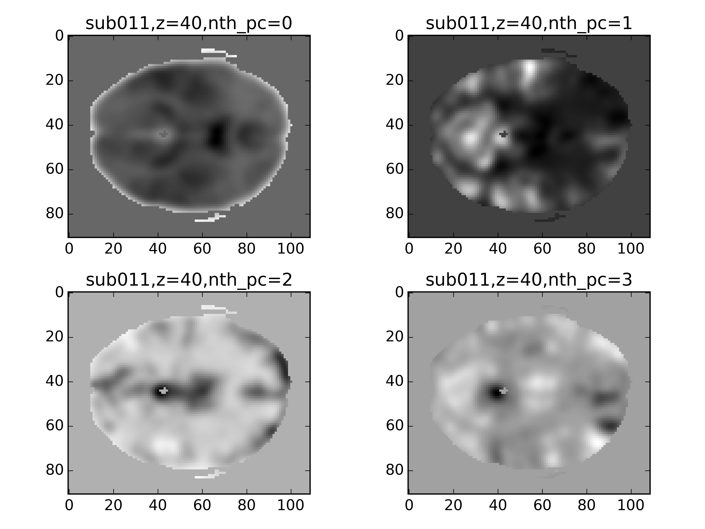
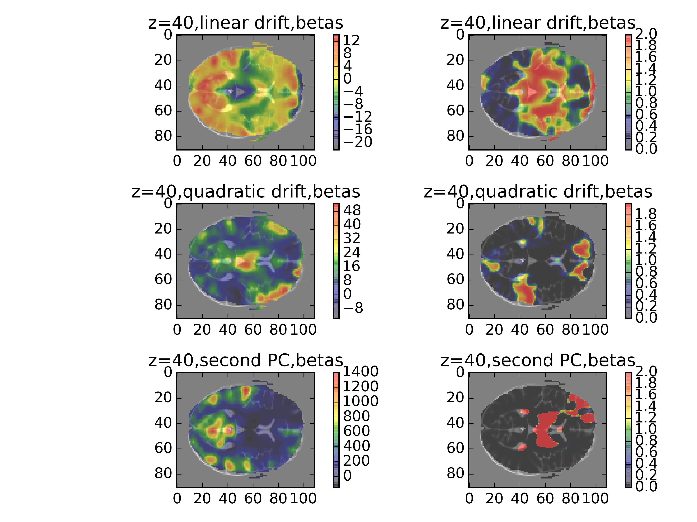
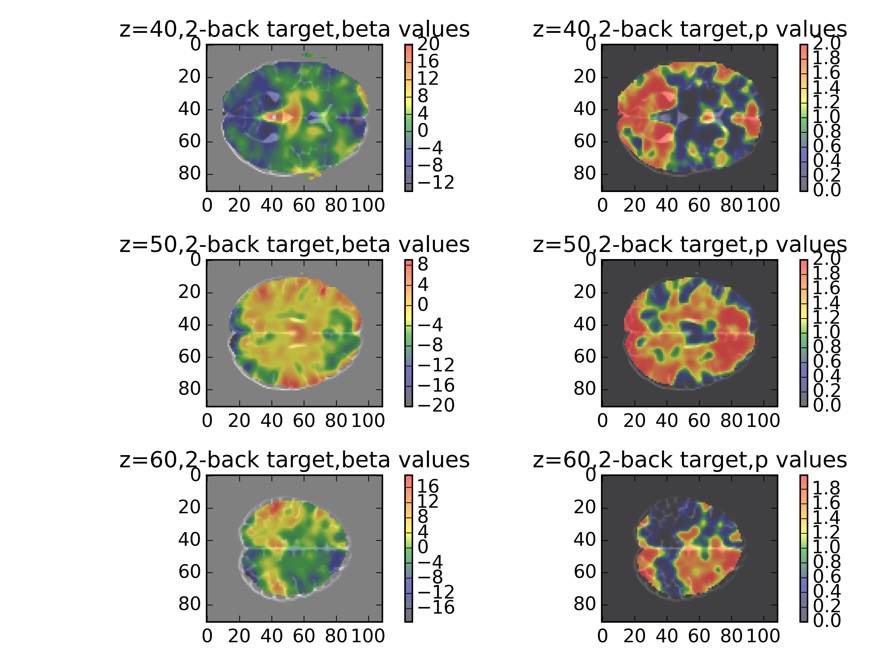
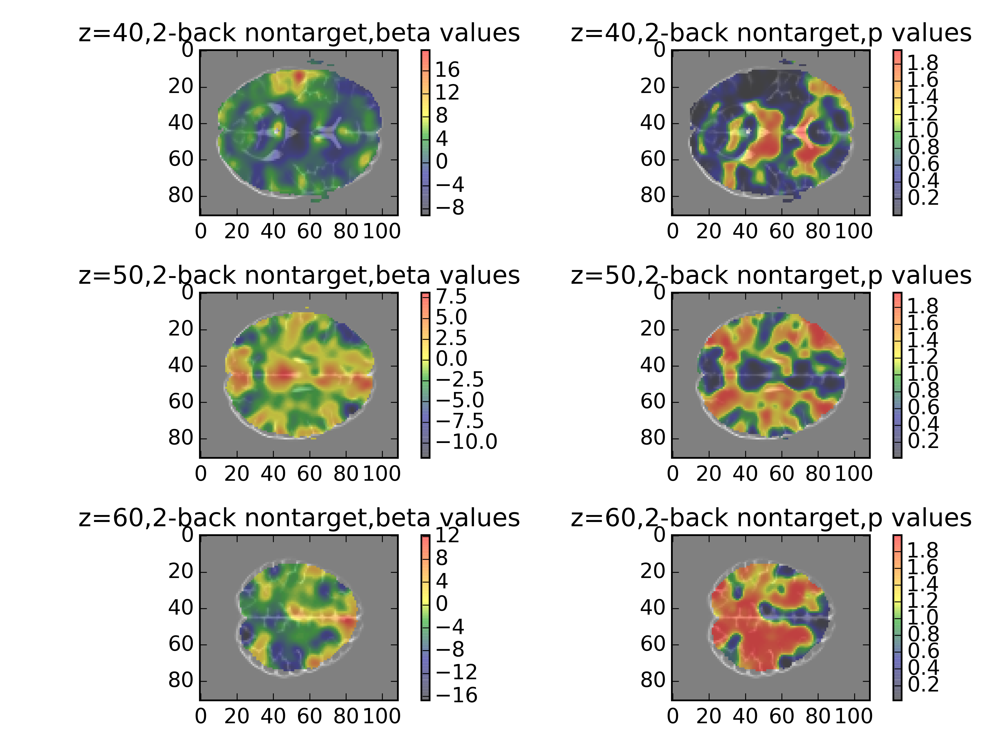

% Project Gamma Progress Report
% Nima Hejazi, Feng Lin, Luyun Zhao, Xinyue Zhou
% December 3, 2015

## Essential Background

- "Working memory in healthy and schizophrenic individuals"
- Accession number: ds115 (from the OpenFMRI.org website)
- The paper(s) used ANOVA to explore within/between network connectivity wrt working memory measures.
- The goal was to identify regions contributing to impaired cognitive function in schizophrenics.
- The method was fcMRI, collecting activation and connectivity (resting) fMRI data.
- 102 subjects: individuals with schizophrenia, their healthy siblings, and controls.
- N-back memeory tasks

## Goals (GLM)

- Goal of GLM: detect the activation clusters of target and non-target events in one control subject
- Subgoals:

	(1) Compare 0-back and 2-back tasks for one subject
	(2) Identify noise regressors so that we can remove them from data for connectivity analysis

- Definitions:

	(1) A target: the event that the current letter is the same as the nth preceeding letter
	(2) A non-target: the opposite of a target, in which the current letter is not the same
	(3) An activation cluster: a group of neighboring voxels activated beyond certain statistical threshold (t-test p value) by defined events

## Goals (Connectivity)

- The goal of connectivity analysis is to compare the functional brain connectivity, measured by ROI-ROI correlations of 2-back task data between the four networks of the brain (DMN,FP,CO,CER), across CON and SCZ groups. 

	(1) 2-back task: difficult to perform, requires highest memory load, more likely to reveal the difference
	(2) four networks: DMN,FP,CO,CER are thought to be critical for cognitive function and defined in the paper		 	 	 		
	(3) CON: control and their siblings; SCZ: schizophrenia and their siblings

## The Method (GLM - Confition Files)

- cond001: Start cues for both blocks of the run
- cond002: Letters presenteed to the subject
- cond003: Target and non-target events during the run
- cond004: Done cues for both blocks of the run
- cond005: Start times and durations of the two blocks
- cond006: Excluded; Unknown and not explained in the paper
- cond007: Errors made by the subject: misidentifying either a target or a non-target

## The Method (GLM - Functional Regressors)

- Convolve neural predictions rescaled at a time unit of 0.01 TR with a gamma function
- Take the convolved values at the start of each TR
- Regressors:

	(1) reg001: Convolution of target events
	(2) reg002: Convolution of non-target events
	(3) reg003: On-off neural predictions for the two blocks: account for block differences
	(4) reg004 & reg005: Convolution of start cues and done cues: Not likely to involve heavy working memory load compared to task-related regressors

## The Method (GLM - Noise Regressors)

- reg006 & reg007: A linear drift term and a quadratic drift term as potential nuisansance regressors
- reg008 and reg009: The first two principal components of the data. Based on the projections shown below, we decide that the first two are not functional features
- reg010: Intercept

## The Method (GLM - Noise Regressors)

## The Method (GLM - Noise Regressors)

## The Method (GLM - Analysis)
- Standard processed brain -> pad brain boundary -> pass through Gaussian filter of $\sigma=2$ -> GLM for each voxel time course
- For each $\beta$ on each voxel time course, a linear regression two-tailed t-test
    (1) null hypothesis: $\beta=0$
    (2) alternative hypothesis: $\beta\neq0$
- Assumption 1: Residuals of each linear model are independent and identically distribued (i.i.d)
- Assumption 2: Residuals for the model are normally distributed
    (1) Shapiro-Wilk Test per voxel: 37703 out of 207766 voxels failed
    (2) Testing normality of several models together
        i. Hochberg (6 / 207766 voxels failed)
        ii. Benjamini-Hochberg tests (all passed)

## Method (Connectivity)

- Remove noise regressors identified in the GLM from the voxel time series
- Extract the voxels per ROI and validate: given the center index and the diameter
	(1) sphere regions instead of cubic regions
	(2) ROIs are non-overlapping

## Method (Connectivity)

- Compute the ROI-ROI correlation
	(1) for each ROI, get the average time series;
	(2) for any two networks, obtain the correlation matrix containing the r-values of any two ROIs for the two networks;
	(3) for each subject, we get the correlation matrix;  
	(4) for several subjects, group the r-values into CON and SCZ group based on the category of the subjects

## Results I (GLM)

- Use of the GLM approach reveals that the 2-back task activate occipital and prefrontal regions more, as would be expected based on the higher cognitive load associated with these tasks.
- The coefficient and p-value maps displayed in the following slides illustrate the activations across several axial slices. 
- The target 2-back task seems to activate many of the regions we would expect by a task associated with both visual processing and working memory.
- The non-target 2-back task activates a wider variety of regions, highlighting a difference in the neural dynamics between the two different types of tasks.

## Results II (GLM)

## Results III (GLM)

## Results (Connectivity)
- Analyze on 20 subjects, 12 SCZ and 8 CON 
- the individuals with schizophrenia and their siblings (SCZ) showed an overall reduction in connectivity between the cognitive control networks as compared to CON 
	 	 	 							
## 

## Discussion

- get better result on more subjects 
- Perform permutation test to statistically validate the difference of connectivity between SCZ and CON

