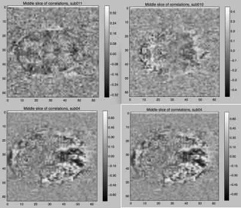

% Project Gamma Progress Report
% Nima Hejazi, Feng Lin, Luyun Zhao, Xinyue Zhou
% November 12, 2015

# Background

## The Paper

- "Working memory in healthy and schizophrenic individuals"
- Accession number: ds000115 (from the OpenFMRI.org website)
- The paper(s) used ANOVA to explore within/between network connectivity wrt working memory measures.
- The goal was to identify regions contributing to impaired cognitive function in schizophrenics.

## The Data

- The method was fcMRI, collecting activation and connectivity (resting) fMRI data.
- 102 subjects: individuals with schizophrenia, their healthy siblings, and controls.
- A task in which subjects identified repeating letters in an interval was administered.
- The data includes anatomical (MRI) and functional (BOLD fMRI) with condition files.

## The Method

- After appropriate preprocessing (e.g., Talairach transform), the paper(s) used ANOVA to compare groups.
- The main comparisons examined resting connectivity between and within network regions of interest.
- In order to assess reported analyses, we performed voxel-wise linear models (as seen in lecture).
- Going further, we attempt to define network regions based on activity patterns with machine learning.

## Statistical Analysis and Validation

- Identify activation regions by
    (1) visualzing correlations between the voxel time course and neural prediction per voxel
    (2) obtaining clusters from K-Means
- Validate linear model assumption by normality testing of residuals

## Correlations between the voxel time course and neural prediction per voxel

## Unsupervised Learning with K-Means

- Use K-means to cluster voxels into 5 groups with different feature set.
- Combine multiple clustering results via a voting algorithm.
- Features used per voxel: 
    (1) mean BOLD measurements over timecouse
    (2) BOLD over timecourse
    (3) normalized BOLD over timecourse

## K-Means Results and Diagnosis

## Future

- Extend and fine-tune K-Means to focus on functional aspects of the data
    (1) Improve features by inspecting and removing first principle components
    (2) Improve features by 
        i. fitting them to a linear models (e.g. with a drift term in the design matrix) 
        ii. taking the residuals
- Refine existing analysis by reducing noise
- Apply and compare existing analysis on all data sets
- Research other machine learning techniques to further explore activation regions

## Future

# Process

## What has been the hardest part?